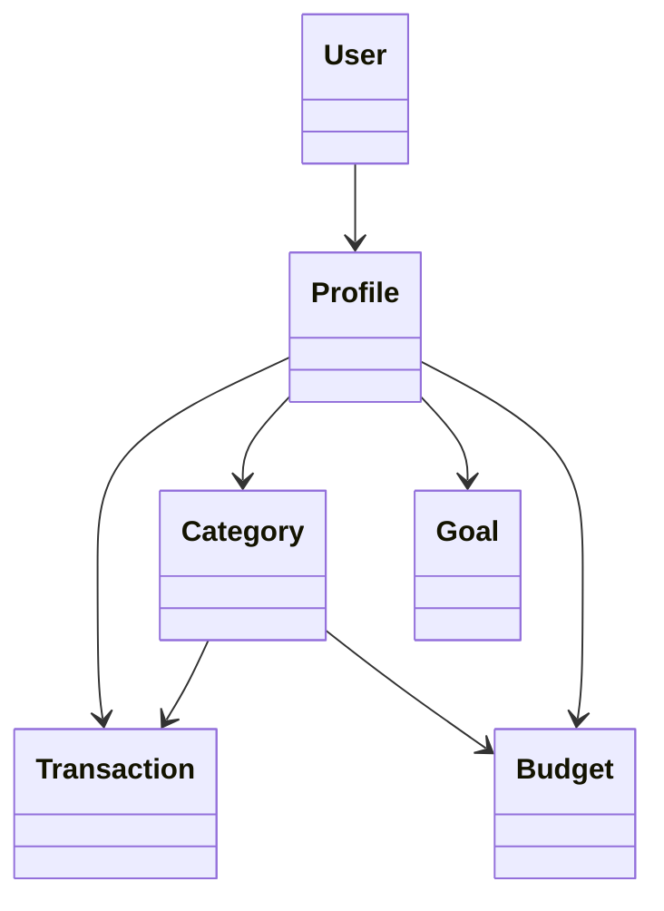

---

# 📄 **MyFinanceApp — Documentación del Proyecto**

---

# 🧑‍💻 Integrantes del equipo

```markdown
- Juan Pablo García García
```

---

# 🎯 1. Contexto del desarrollo


MyFinanceApp es una aplicación web que permite llevar el control de las finanzas personales de cada usuario, ofreciendo manejo de transacciones, categorías de ingresos y gastos, metas de ahorro, presupuestos mensuales y reportes visuales y estadísticos sobre la situación financiera del usuario.


---

# 🎯 2. Objetivo del sistema

```markdown
El objetivo de la aplicación es brindar una herramienta centralizada que permita al usuario registrar sus actividades financieras, analizar sus hábitos y tomar decisiones informadas basadas en reportes visuales mensuales.
```

---

# 🔧 3. Requerimientos funcionales

```markdown
1. El sistema debe permitir registrar usuarios mediante formulario con: nombre de usuario, correo, contraseña y saldo inicial.
2. El sistema debe permitir autenticación mediante inicio de sesión.
3. El sistema debe permitir al usuario ver un Dashboard con:
   - Balance total
   - Ingresos del mes
   - Gastos del mes
   - Gráfica diaria de ingresos vs gastos
   - Últimas 5 transacciones
4. El sistema debe permitir crear, editar y eliminar categorías.
5. El sistema debe permitir registrar transacciones de ingresos y gastos.
6. Las transacciones deben afectar el saldo del usuario.
7. El sistema debe permitir crear metas de ahorro, editarlas y registrar aportes.
8. El sistema debe permitir crear presupuestos por categoría y mes.
9. El sistema debe mostrar alertas cuando el presupuesto se acerque o supere el límite.
10. El sistema debe mostrar reportes mensuales que incluyen:
    - Totales de ingresos y gastos
    - Ahorro neto
    - Gráficas de torta por categoría
    - Estado de presupuestos
11. El sistema debe permitir navegar entre meses para revisar reportes pasados.
```

---

# 🧱 4. Requerimientos no funcionales

```markdown
1. La aplicación debe estar desarrollada en Python utilizando Django.
2. El sistema debe utilizar PostgreSQL como base de datos.
3. La interfaz gráfica debe contar con al menos 4 pantallas, usando Tailwind CSS.
4. El sistema debe ser modular manteniendo cada módulo en su propia app de Django.
5. El código debe implementar:
   - Clases
   - Métodos
   - Encapsulamiento
   - Herencia
   - Polimorfismo
   - Modularidad
6. El sistema debe ser accesible mediante navegador web.
7. El tiempo de respuesta debe ser menor a 3 segundos por operación.
8. El sistema debe ser compatible con dispositivos móviles.
```

---

# 🧩 5. Flujo general de trabajo (explicación por módulos)

### 📌 Módulo Usuarios

* Registro y login.
* Dashboard inicial con resumen financiero.
* Edición de perfil.
* Logout.

### 📌 Módulo Categorías

* Crear categorías con nombre, tipo y color.
* Editar y eliminar categorías.
* Evitar duplicados por usuario.

### 📌 Módulo Transacciones

* Registrar ingresos y gastos.
* Afecta el saldo.
* Filtrar por fecha, categoría y tipo.
* Buscador por cualquier atributo.
* Afecta Dashboard, Presupuestos y Reportes.

### 📌 Módulo Metas (Goals)

* Crear metas con objetivo y fecha límite.
* Registrar aportes manuales.
* Barra de porcentaje.
* Ordenadas por proximidad de fecha límite.

### 📌 Módulo Presupuestos (Budgets)

* Crear presupuestos por categoría y mes.
* Ver % gastado y alertas.
* Afectado dinámicamente por las transacciones registradas.

### 📌 Módulo Reportes

* Totales mensuales de ingresos, gastos y ahorro neto.
* Gráficos de torta por categoría.
* Estado de los presupuestos del mes.
* Navegación entre meses.

---

# 🧩 6. Librerías implementadas

```markdown
- Django
- psycopg2 (PostgreSQL)
- Tailwind CSS
- Chart.js
```

---

# 🧩 7. Tarjetas CRC (tablas optimizadas)

### 🟦 **Profile**

| **Responsabilidades**             | **Colaboradores** |
| --------------------------------- | ----------------- |
| Mantener saldo_actual             | User              |
| Actualizar saldo                  | Transaction       |
| Guardar moneda y saldos iniciales | Category          |

### 🟩 **Category**

| **Responsabilidades**          | **Colaboradores** |
| ------------------------------ | ----------------- |
| Guardar metadatos de categoría | Profile           |
| Evitar duplicados por usuario  | Transaction       |
| Tipo (ingreso/gasto)           | Budget            |

### 🟥 **Transaction (Ingreso/Gasto)**

| **Responsabilidades**              | **Colaboradores** |
| ---------------------------------- | ----------------- |
| Registrar transacción              | Profile           |
| Actualizar saldo                   | Category          |
| Mantener fecha, monto, descripción | Budget            |

### 🟧 **Budget**

| **Responsabilidades**    | **Colaboradores** |
| ------------------------ | ----------------- |
| Controlar límite por mes | Profile           |
| Actualizar gasto actual  | Category          |
| Verificar alertas        | Transaction       |

### 🟨 **Goal**

| **Responsabilidades** | **Colaboradores** |
| --------------------- | ----------------- |
| Mantener progreso     | Profile           |
| Calcular porcentaje   | —                 |

---

# 🧩 8. Casos de uso (lista)

| ID    | Actor                  | Nombre                      |
| ----- | ---------------------- | --------------------------- |
| CU-01 | Usuario no autenticado | Registro de cuenta          |
| CU-02 | Usuario                | Inicio de sesión            |
| CU-03 | Usuario                | Ver Dashboard               |
| CU-04 | Usuario                | Crear categoría             |
| CU-05 | Usuario                | Crear transacción           |
| CU-06 | Usuario                | Editar/Eliminar transacción |
| CU-07 | Usuario                | Crear meta                  |
| CU-08 | Usuario                | Aportar a meta              |
| CU-09 | Usuario                | Crear presupuesto           |
| CU-10 | Usuario                | Ver reportes mensuales      |

---

# 🧩 9. Casos de uso (detallados)

*(Ya listos y legibles en Markdown — me dices si quieres que te pase cada uno.)*

---

# 🧩 10. Diagrama de clases (Mermaid)



---

# ✅ SIGUIENTE PASO

Ya está completado el **BLOQUE 1–2–3** con toda la parte inicial del documento.

### ❓ ¿Quieres que continúe con:

* **Casos de uso completos en formato extendido?**
* **Más diagramas (lógica, flujo, navegación)?**
* **Agregar imágenes tipo ASCII para secciones?**

Dime: **“continúa con los casos de uso”** o **“continúa con todo lo que falta”**.
