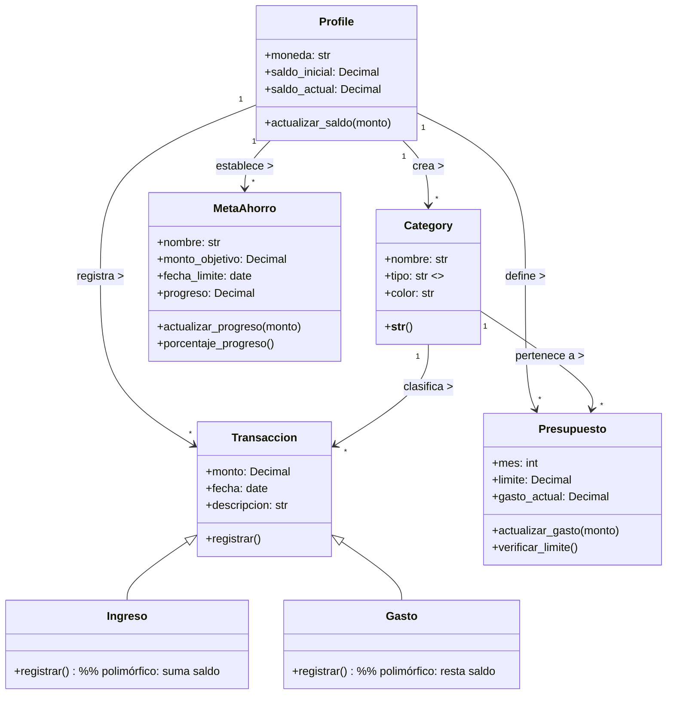

#  **MyFinanceApp — Documentación del Proyecto**


# 🧑‍💻 Integrantes del equipo

```markdown
- Juan Pablo García García
```

---

# 🎯 1. Contexto del desarrollo


MyFinanceApp es una aplicación web que permite llevar el control de las finanzas personales de cada usuario, ofreciendo manejo de transacciones, categorías de ingresos y gastos, metas de ahorro, presupuestos mensuales y reportes visuales y estadísticos sobre la situación financiera del usuario.


---

# 🎯 2. Objetivo del sistema


El objetivo de la aplicación es brindar una herramienta centralizada que permita al usuario registrar sus actividades financieras, analizar sus hábitos y tomar decisiones informadas basadas en reportes visuales mensuales.


---

# 🔧 3. Requerimientos funcionales


1. El sistema debe permitir registrar usuarios mediante formulario con: nombre de usuario, correo, contraseña y saldo inicial.
2. El sistema debe permitir autenticación mediante inicio de sesión.
3. El sistema debe permitir al usuario ver un Dashboard con:
   - Balance total
   - Ingresos del mes
   - Gastos del mes
   - Gráfica diaria de ingresos vs gastos
   - Últimas 5 transacciones
4. El sistema debe permitir crear, editar y eliminar categorías.
5. El sistema debe permitir registrar transacciones de ingresos y gastos.
6. Las transacciones deben afectar el saldo del usuario.
7. El sistema debe permitir crear metas de ahorro, editarlas y registrar aportes.
8. El sistema debe permitir crear presupuestos por categoría y mes.
9. El sistema debe mostrar alertas cuando el presupuesto se acerque o supere el límite.
10. El sistema debe mostrar reportes mensuales que incluyen:
    - Totales de ingresos y gastos
    - Ahorro neto
    - Gráficas de torta por categoría
    - Estado de presupuestos
11. El sistema debe permitir navegar entre meses para revisar reportes pasados.


---

# 🧱 4. Requerimientos no funcionales


1. La aplicación debe estar desarrollada en Python utilizando Django.
2. El sistema debe utilizar PostgreSQL como base de datos.
3. La interfaz gráfica debe contar con al menos 4 pantallas, usando Tailwind CSS.
4. El sistema debe ser modular manteniendo cada módulo en su propia app de Django.
5. El código debe implementar:
   - Clases
   - Métodos
   - Encapsulamiento
   - Herencia
   - Polimorfismo
   - Modularidad
6. El sistema debe ser accesible mediante navegador web.
7. El tiempo de respuesta debe ser menor a 3 segundos por operación.
8. El sistema debe ser compatible con dispositivos móviles.


---

# 🐳 5. Flujo general de trabajo (explicación por módulos)

### 📌 Módulo Usuarios

* Registro y login.
* Dashboard inicial con resumen financiero.
* Edición de perfil.
* Logout.

### 📌 Módulo Categorías

* Crear categorías con nombre, tipo y color.
* Editar y eliminar categorías.
* Evitar duplicados por usuario.

### 📌 Módulo Transacciones

* Registrar ingresos y gastos.
* Afecta el saldo.
* Filtrar por fecha, categoría y tipo.
* Buscador por cualquier atributo.
* Afecta Dashboard, Presupuestos y Reportes.

### 📌 Módulo Metas (Goals)

* Crear metas con objetivo y fecha límite.
* Registrar aportes manuales.
* Barra de porcentaje.
* Ordenadas por proximidad de fecha límite.

### 📌 Módulo Presupuestos (Budgets)

* Crear presupuestos por categoría y mes.
* Ver % gastado y alertas.
* Afectado dinámicamente por las transacciones registradas.

### 📌 Módulo Reportes

* Totales mensuales de ingresos, gastos y ahorro neto.
* Gráficos de torta por categoría.
* Estado de los presupuestos del mes.
* Navegación entre meses.

---

# 🧩 6. Librerías implementadas


- Django
- psycopg2 (PostgreSQL)
- Tailwind CSS
- Chart.js


---

# 🧩 7. Tarjetas CRC (tablas optimizadas)

### 🟦 **Profile**

| **Responsabilidades**             | **Colaboradores** |
| --------------------------------- | ----------------- |
| Mantener saldo_actual             | User              |
| Actualizar saldo                  | Transaction       |
| Guardar moneda y saldos iniciales | Category          |

### 🟩 **Category**

| **Responsabilidades**          | **Colaboradores** |
| ------------------------------ | ----------------- |
| Guardar metadatos de categoría | Profile           |
| Evitar duplicados por usuario  | Transaction       |
| Tipo (ingreso/gasto)           | Budget            |

### 🟥 **Transaction (Ingreso/Gasto)**

| **Responsabilidades**              | **Colaboradores** |
| ---------------------------------- | ----------------- |
| Registrar transacción              | Profile           |
| Actualizar saldo                   | Category          |
| Mantener fecha, monto, descripción | Budget            |

### 🟧 **Budget**

| **Responsabilidades**    | **Colaboradores** |
| ------------------------ | ----------------- |
| Controlar límite por mes | Profile           |
| Actualizar gasto actual  | Category          |
| Verificar alertas        | Transaction       |

### 🟨 **Goal**

| **Responsabilidades** | **Colaboradores** |
| --------------------- | ----------------- |
| Mantener progreso     | Profile           |
| Calcular porcentaje   | —                 |

---

# 🧩 8. Casos de uso (lista)

| ID    | Actor                  | Nombre                      |
| ----- | ---------------------- | --------------------------- |
| CU-01 | Usuario no autenticado | Registro de cuenta          |
| CU-02 | Usuario                | Inicio de sesión            |
| CU-03 | Usuario                | Ver Dashboard               |
| CU-04 | Usuario                | Crear categoría             |
| CU-05 | Usuario                | Crear transacción           |
| CU-06 | Usuario                | Editar/Eliminar transacción |
| CU-07 | Usuario                | Crear meta                  |
| CU-08 | Usuario                | Aportar a meta              |
| CU-09 | Usuario                | Crear presupuesto           |
| CU-10 | Usuario                | Ver reportes mensuales      |

---

# 🧩 9. Casos de uso (detallados)
---

## 🟦 **CU-01 — Registro de usuario**


**Nombre:** Registro de cuenta  
**Código:** CU-01  
**Creado por:** Juan Pablo García  
**Fecha de creación:** 2025  
**Actores:** Usuario no autenticado  
**Descripción:**  
Permite que un nuevo usuario cree una cuenta proporcionando nombre de usuario, correo, contraseña y saldo inicial.

**Disparador:**  
El usuario selecciona la opción "Registrarse".

**Precondiciones:**  
- El usuario no debe tener una cuenta registrada previamente.  
- Todos los campos deben estar completos.

**Postcondiciones:**  
- Se crea un registro en la base de datos.  
- Se genera automáticamente un perfil asociado al usuario.

**Flujo normal:**  
1. El usuario accede al formulario de registro.  
2. Ingresa nombre de usuario, correo, contraseña y saldo inicial.  
3. Confirma el registro.  
4. El sistema crea el usuario y su perfil.  
5. El usuario es redirigido al login.

**Flujos alternativos:**  
- **F1:** El usuario ingresa un correo ya registrado → Se muestra mensaje de error.  
- **F2:** El usuario deja campos vacíos → Se muestran errores de validación.  


---

## 🟦 **CU-02 — Inicio de sesión**


**Nombre:** Inicio de sesión  
**Código:** CU-02  
**Creado por:** Juan Pablo García  
**Fecha de creación:** 2025  
**Actores:** Usuario  
**Descripción:**  
Permite que un usuario autenticado acceda a la plataforma.

**Disparador:**  
El usuario selecciona “Iniciar sesión”.

**Precondiciones:**  
- El usuario debe estar registrado.

**Postcondiciones:**  
- Se crea sesión activa.  
- El usuario es enviado al Dashboard.

**Flujo normal:**  
1. El usuario ingresa usuario y contraseña.  
2. El sistema valida credenciales.  
3. Accede al Dashboard.

**Flujos alternativos:**  
- **F1:** Contraseña incorrecta → Mensaje de error.  
- **F2:** Usuario no registrado → Mensaje de error.  


---

## 🟦 **CU-03 — Ver Dashboard**


**Nombre:** Ver Dashboard  
**Código:** CU-03  
**Creado por:** Juan Pablo García  
**Fecha de creación:** 2025  
**Actores:** Usuario  
**Descripción:**  
El usuario visualiza un resumen financiero del mes actual, incluyendo balance total, ingresos, gastos, gráficas y últimas transacciones.

**Disparador:**  
El usuario inicia sesión o selecciona “Dashboard”.

**Precondiciones:**  
- El usuario debe estar autenticado.

**Postcondiciones:**  
- Se muestran datos actualizados del mes actual.

**Flujo normal:**  
1. El usuario accede al Dashboard.  
2. El sistema consulta ingresos y gastos del mes.  
3. Calcula balance total.  
4. Muestra gráfica diaria.  
5. Muestra últimas 5 transacciones.

**Flujos alternativos:**  
- **F1:** No existen transacciones registradas → Se muestran valores en 0.  


---

## 🟦 **CU-04 — Crear categoría**


**Nombre:** Crear categoría  
**Código:** CU-04  
**Creado por:** Juan Pablo García  
**Fecha de creación:** 2025  
**Actores:** Usuario  
**Descripción:**  
Permite al usuario crear categorías personalizadas para clasificar transacciones.

**Disparador:**  
El usuario selecciona “Crear categoría”.

**Precondiciones:**  
- El usuario debe estar autenticado.  
- El nombre no debe existir ya en sus categorías.

**Postcondiciones:**  
- La categoría queda registrada y disponible.

**Flujo normal:**  
1. El usuario accede al módulo de categorías.  
2. Ingresa nombre, tipo y color.  
3. Confirma creación.  
4. El sistema valida duplicados.  
5. Se guarda la categoría.

**Flujos alternativos:**  
- **F1:** Nombre repetido → Se muestra error.  


---

## 🟦 **CU-05 — Crear transacción**


**Nombre:** Crear transacción  
**Código:** CU-05  
**Creado por:** Juan Pablo García  
**Fecha de creación:** 2025  
**Actores:** Usuario  
**Descripción:**  
Permite registrar ingresos o gastos que afectan el saldo del usuario y actualizan métricas.

**Disparador:**  
El usuario selecciona “Nueva transacción”.

**Precondiciones:**  
- El usuario debe estar autenticado.  
- Debe existir al menos una categoría creada.

**Postcondiciones:**  
- Se guarda la transacción.  
- Se actualiza el saldo.  
- Se afectan reportes, presupuestos y Dashboard.

**Flujo normal:**  
1. El usuario abre el formulario.  
2. Ingresa tipo, categoría, monto, fecha y descripción.  
3. El sistema guarda la transacción.  
4. Actualiza el saldo del usuario.  
5. Actualiza presupuestos asociados.  
6. Redirige al listado.

**Flujos alternativos:**  
- **F1:** Datos inválidos → Error de validación.  


---

## 🟦 **CU-06 — Editar o eliminar transacción**


**Nombre:** Editar/Eliminar transacción  
**Código:** CU-06  
**Creado por:** Juan Pablo García  
**Fecha de creación:** 2025  
**Actores:** Usuario  
**Descripción:**  
Permite modificar o borrar transacciones existentes.

**Disparador:**  
El usuario selecciona la opción editar o eliminar.

**Precondiciones:**  
- El usuario debe haber registrado transacciones.

**Postcondiciones:**  
- Los cálculos de saldo y presupuestos se recalculan.

**Flujo normal:**  
1. El usuario abre una transacción existente.  
2. Modifica sus campos o selecciona eliminar.  
3. El sistema guarda cambios.  
4. Actualiza saldo y presupuestos.

**Flujos alternativos:**  
- **F1:** Transacción inexistente → Error.  


---

## 🟦 **CU-07 — Crear meta de ahorro**


**Nombre:** Crear meta de ahorro  
**Código:** CU-07  
**Creado por:** Juan Pablo García  
**Fecha de creación:** 2025  
**Actores:** Usuario  
**Descripción:**  
El usuario registra una meta de ahorro con un monto objetivo y fecha límite.

**Disparador:**  
El usuario selecciona “Nueva meta”.

**Precondiciones:**  
- Debe estar autenticado.

**Postcondiciones:**  
- La meta queda disponible con progreso inicial 0%.

**Flujo normal:**  
1. El usuario abre el formulario.  
2. Agrega nombre, monto objetivo y fecha límite.  
3. Confirma creación.  
4. El sistema registra la meta.

**Flujos alternativos:**  
- **F1:** Datos vacíos → Error.  


---

## 🟦 **CU-08 — Aportar a meta**


**Nombre:** Aportar a meta  
**Código:** CU-08  
**Creado por:** Juan Pablo García  
**Fecha de creación:** 2025  
**Actores:** Usuario  
**Descripción:**  
Permite sumar aportes a una meta de ahorro, aumentando la barra de progreso.

**Disparador:**  
Usuario selecciona “Añadir aporte”.

**Precondiciones:**  
- Debe existir la meta.

**Postcondiciones:**  
- Se actualiza el progreso de la meta.

**Flujo normal:**  
1. El usuario ingresa monto del aporte.  
2. El sistema suma al progreso actual.  
3. Recalcula el porcentaje.

**Flujos alternativos:**  
- **F1:** Monto no válido → Error.  


---

## 🟦 **CU-09 — Crear presupuesto**


**Nombre:** Crear presupuesto  
**Código:** CU-09  
**Creado por:** Juan Pablo García  
**Fecha de creación:** 2025  
**Actores:** Usuario  
**Descripción:**  
El usuario define un límite mensual por categoría.

**Disparador:**  
Selecciona “Nuevo presupuesto”.

**Precondiciones:**  
- Deben existir categorías.

**Postcondiciones:**  
- El presupuesto queda registrado.

**Flujo normal:**  
1. Usuario abre formulario.  
2. Selecciona categoría, mes y establece límite.  
3. El sistema guarda el presupuesto.

**Flujos alternativos:**  
- **F1:** Presupuesto ya existente para mes y categoría → Error.  


---

## 🟦 **CU-10 — Ver reportes mensuales**


**Nombre:** Ver reportes mensuales  
**Código:** CU-10  
**Creado por:** Juan Pablo García  
**Fecha de creación:** 2025  
**Actores:** Usuario  
**Descripción:**  
Muestra totales de ingresos, gastos, ahorro neto y gráficos por categoría para un mes.

**Disparador:**  
Usuario ingresa al módulo “Reportes”.

**Precondiciones:**  
- Deben existir transacciones o presupuestos en el mes seleccionado.

**Postcondiciones:**  
- Se muestran estadísticas correctas.

**Flujo normal:**  
1. Usuario entra a Reportes.  
2. Selecciona mes anterior o siguiente.  
3. El sistema calcula totales y gráficos.  
4. Muestra estado de presupuestos.

**Flujos alternativos:**  
- **F1:** No hay datos del mes → Se muestran valores vacíos.  


---

# 🧩 10. Diagrama de clases (Mermaid)



---

